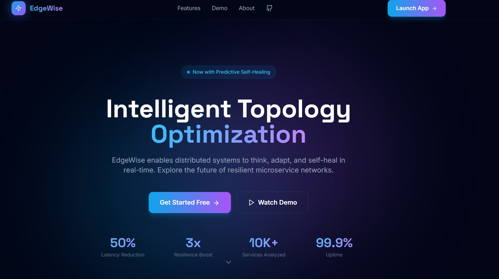
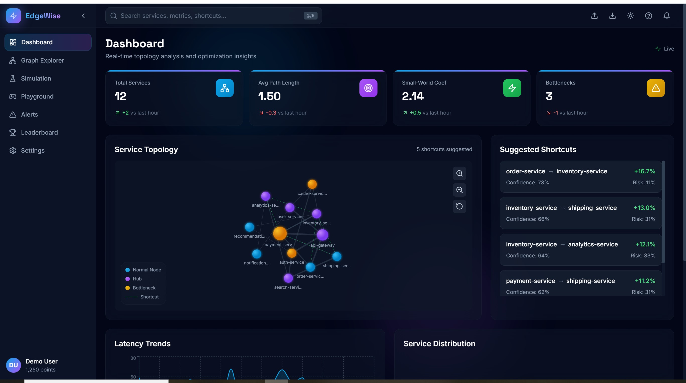
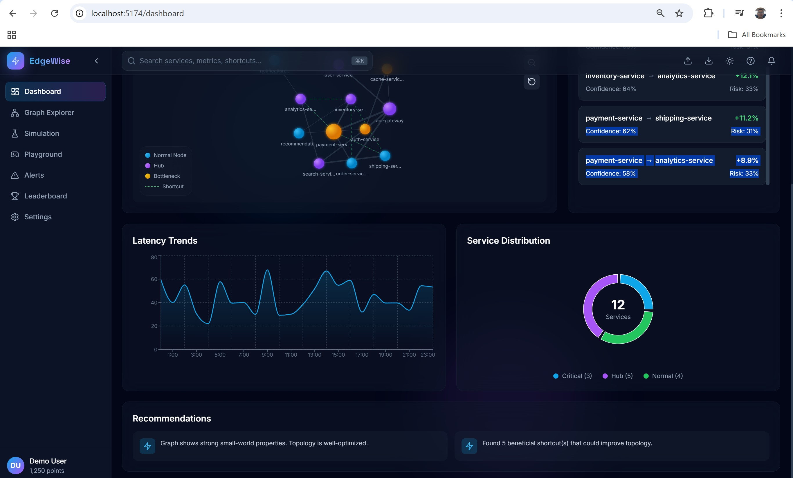
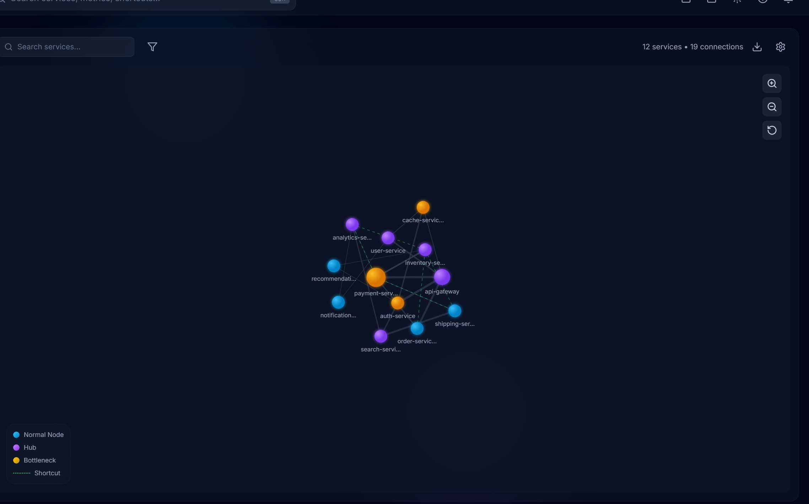
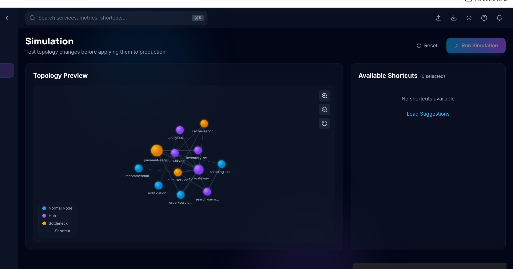
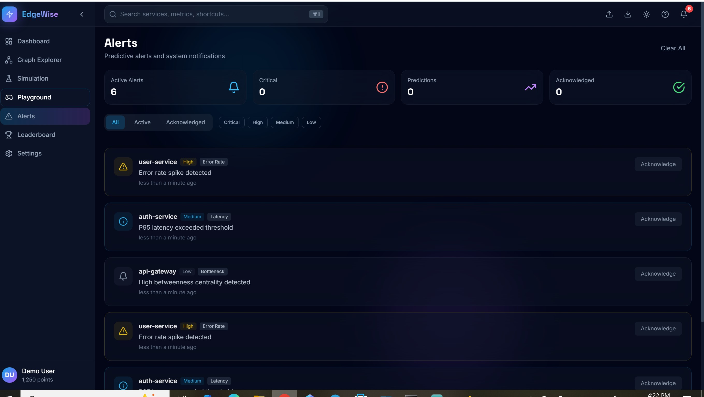
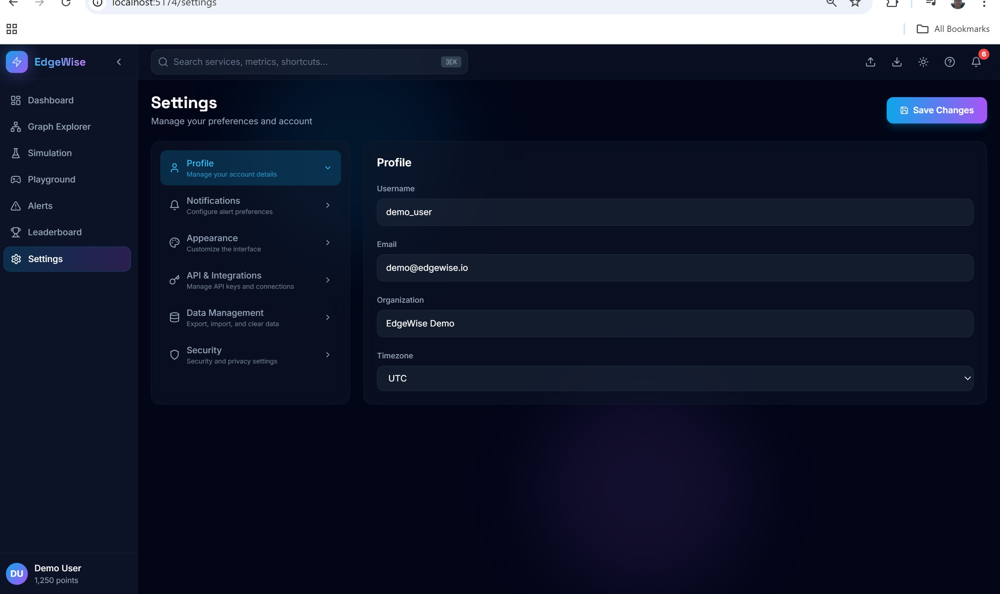

# EdgeWise

Microservice topology optimizer based on small-world network theory. Analyzes service dependency graphs and finds shortcut edges that reduce latency and improve fault tolerance.



## Why?

Most microservice architectures evolve organically into messy dependency graphs. Services call other services that call other services - before you know it, a simple user request traverses 8 hops. Each hop adds latency and another failure point.

Small-world networks (like your brain's neural network, or social networks) solve this with a simple trick: add a few strategic "shortcut" connections. You get the benefits of modularity *and* short paths.

EdgeWise analyzes your topology and tells you exactly which shortcuts to add.

## Install

```bash
pip install smallworld-services
```

Or run with Docker:

```bash
docker run -p 8000:8000 smallworld/edgewise
```

## Usage

### Command Line

```bash
# analyze your topology
smallworld analyze services.json

# just show metrics
smallworld metrics services.json

# start the web UI
smallworld serve
```

### Python

```python
from smallworld import GraphBuilder, MetricsCalculator, ShortcutOptimizer
from smallworld.io import JsonLoader

topology = JsonLoader.load_from_file("services.json")

builder = GraphBuilder()
graph = builder.build_from_topology(topology)

# get metrics
calc = MetricsCalculator(graph=graph)
metrics, nodes = calc.calculate_all()

print(f"avg path length: {metrics.average_path_length:.2f}")
print(f"small-world coef: {metrics.small_world_coefficient:.2f}")

# find shortcuts
optimizer = ShortcutOptimizer(graph=graph)
optimizer.set_goal("latency")  # or "paths", "load", "balanced"

for shortcut in optimizer.find_shortcuts(k=5):
    print(f"  {shortcut.source} -> {shortcut.target}")
```

### REST API

```bash
curl -X POST http://localhost:8000/analyze \
  -H "Content-Type: application/json" \
  -d @services.json
```



## Input Format

```json
{
  "services": [
    {"name": "api-gateway", "replicas": 3, "criticality": "critical"},
    {"name": "auth", "replicas": 2},
    {"name": "users", "replicas": 2},
    {"name": "orders", "replicas": 4}
  ],
  "edges": [
    {"from": "api-gateway", "to": "auth", "call_rate": 1000, "p50": 5, "p95": 25},
    {"from": "api-gateway", "to": "orders", "call_rate": 500, "p50": 12, "p95": 60},
    {"from": "auth", "to": "users", "call_rate": 800, "p50": 8, "p95": 40}
  ]
}
```

Fields:
- `call_rate`: requests/sec
- `p50`, `p95`: latency percentiles in ms
- `criticality`: low/medium/high/critical (optional)
- `zone`: availability zone (optional, for zone-aware optimization)

## What You Get

**Graph-level metrics:**
- Average path length (how many hops between services)
- Clustering coefficient (how interconnected neighborhoods are)
- Small-world coefficient (>1 means you have small-world properties)
- Hub/bottleneck identification

**Per-node metrics:**
- Betweenness centrality (how many paths go through this service)
- PageRank (importance based on who calls you)
- Load distribution

**Shortcut recommendations:**
- Which edges to add
- Expected latency improvement
- Risk score (adding edges to already-overloaded services is risky)



## Policy Constraints

Don't want certain services talking directly? Have zone requirements?

```json
{
  "policy": {
    "forbidden_pairs": [["payments", "logging"]],
    "require_same_zone": true,
    "max_new_edges_per_service": 2
  }
}
```

## Web Dashboard

The frontend gives you:
- Interactive graph visualization
- Real-time metrics
- Simulation mode (test shortcuts before deploying)
- Leaderboard (gamification for your team)



```bash
# start backend
smallworld serve --port 8000

# start frontend (from frontend/ dir)
npm install && npm run dev
```



## How It Works

1. Build a directed graph from your service topology
2. Calculate network metrics using NetworkX
3. For each potential shortcut edge:
   - Simulate adding it
   - Measure impact on objective function (path length, betweenness, etc.)
   - Calculate risk score
4. Rank shortcuts by improvement/risk ratio
5. Return top k suggestions

The objective function:

```
OBJ = α * avg_path_length + β * max_betweenness + γ * cost
```

Different optimization goals adjust α, β, γ weights.



## Project Structure

```
smallworld/
  core/
    graph_builder.py      # topology -> networkx graph
    metrics.py            # centrality, clustering, paths
    shortcut_optimizer.py # the magic happens here
  io/
    schemas.py            # pydantic models
    json_loader.py        # file handling
  api/
    app.py                # fastapi endpoints + websocket
  cli.py                  # typer CLI

frontend/
  src/
    pages/                # dashboard, explorer, simulation...
    components/           # reusable UI bits
```

## Dev Setup

```bash
git clone <repo>
cd small-world

# backend
pip install -e ".[dev]"
pytest --cov=smallworld

# frontend
cd frontend
npm install
npm run dev
```



## Tests

303 tests, 100% coverage.

```bash
pytest --cov=smallworld --cov-report=term-missing
```

## License

Apache 2.0
